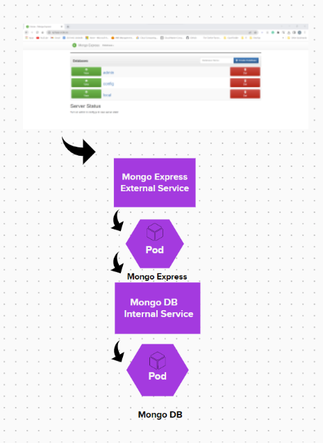

# Deploying MongoDB and Mongo Express with K8s


This project includes the deployment of a MongoDB instance and a mongo-express UI using Kubernetes. The deployment and service objects for both MongoDB and mongo-express are defined in YAML format in the following files:



Here is a structure for the project:
```
project/
├── mongodb-deployment.yaml
├── mongodb-service.yaml
├── mongo-express-deployment.yaml
├── mongo-express-service.yaml
├── mongodb-secret.yaml
└── mongodb-configmap.yaml

```

+ mongodb-deployment.yaml: A deployment object for MongoDB with one replica and a container spec that uses the mongo image. The container exposes port 27017 and uses environment variables for the root username and password, which are stored in a secret.

+ mongodb-service.yaml: A service object for MongoDB with a selector that matches the label of the MongoDB deployment and exposes port 27017.

+ mongo-express-deployment.yaml: A deployment object for mongo-express with one replica and a container spec that uses the mongo-express image. The container exposes port 8081 and uses environment variables for the MongoDB root username and password, which are stored in a secret, as well as a config map for the MongoDB database URL.

+ mongo-express-service.yaml: A service object for mongo-express with a selector that matches the label of the mongo-express deployment and exposes port 8081. This service is of type LoadBalancer and uses a node port to allow external access to the mongo-express UI.

+ mongodb-secret.yaml: A secret object that contains the MongoDB root username and password in base64-encoded format.

+ mongodb-configmap.yaml: A config map object that contains the MongoDB database URL.


## kubectl apply commands in order

kubectl apply -f mongo-secret.yaml
kubectl apply -f mongo.yaml
kubectl apply -f mongo-configmap.yaml
kubectl apply -f mongo-express.yaml


## kubectl get commands

kubectl get pod
kubectl get pod --watch
kubectl get pod -o wide
kubectl get service
kubectl get secret
kubectl get all | grep mongodb


## kubectl debugging commands

kubectl describe pod mongodb-deployment-xxxxxx
kubectl describe service mongodb-service
kubectl logs mongo-express-xxxxxx


## give a URL to external service in minikube

minikube service mongo-express-service
